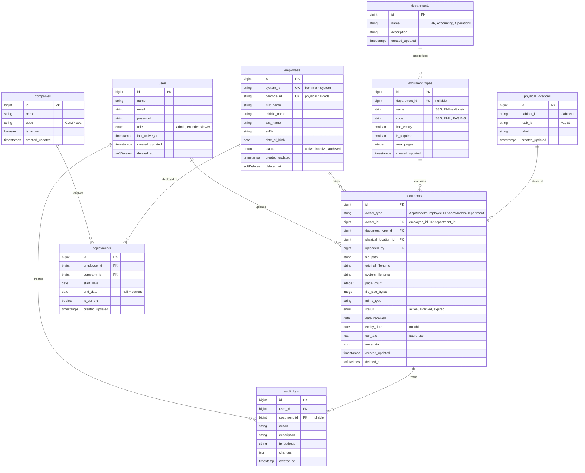

# CSC Document Management System — Implementation Plan v2

## Current State

Fresh **Laravel 12 + Breeze** scaffold. No DMS-specific code exists. Queue driver set to `database` ✔. Bootstrap 5 layout ✔.

---

## Key Decisions (from your feedback)

| Decision | Resolution |
|---|---|
| Multi-page docs | Single PDF per document. Allow multi-file upload → auto-combine into one PDF |
| Frontend | **Blade components + Alpine.js** (recommended — Livewire adds complexity you don't need. Alpine.js gives you reactive search/filters while staying in Blade. Already bundled with Breeze) |
| OCR | **Deferred to future phase** — removed from current scope |
| Departments | Used to **categorize document types** (e.g., HR docs, Accounting docs). Employees are NOT assigned to departments |
| Employee Profile UI | Existing UI to be provided later — will integrate when available |
| Deployment | XAMPP locally (proposal/demo), potential server deployment later |
| Export packages | Deferred — will choose when we reach reporting phase |
| Employee data | ~200 employees via import, ~50k scanned documents to be uploaded over time |
| Barcode workflow | Encoder manually enters `system_id` and `barcode_id` when creating employee profile (pulled from their main cooperative system) |

---

## Storage Estimation (Updated for 50k docs)

| Metric | Value |
|---|---|
| Target volume | 50,000 scanned docs |
| Avg file size (300 DPI B&W PDF) | ~60 KB × 1.5 pages avg |
| **Total storage** | **~4.5 GB** |
| Annual growth (~2,000 docs/month) | ~2.2 GB/year |
| **5-year projection** | ~15.5 GB |

> [!TIP]
> Local storage on XAMPP is perfectly fine. Even a 128GB drive has decades of headroom.

---

## File Naming & Folder Strategy (Updated for Departments)

To cleanly separate **Employee Documents** from **Department Documents**, we will use two distinct folder structures and naming conventions:

**1. Employee Documents**
- **Folder:** `storage/app/documents/employees/{system_id}/`
- **Naming Convention:** `EMP-{system_id}_{doc_type_code}_{YYYYMMDD}.pdf`
- **Duplicate handling:** `EMP-{system_id}_{doc_type_code}_{YYYYMMDD}_143022.pdf`

**2. Department Documents**
- **Folder:** `storage/app/documents/departments/{department_id}/`
- **Naming Convention:** `DEPT-{department_id}_{doc_type_code}_{YYYYMMDD}.pdf`

**Original filename**: Always stored in `documents.original_filename` column for reference, but never used as the storage name.

---

All client companies share the **same global requirements** for Employees. Requirements are managed via the `is_required` flag on `document_types`.

**Admin Settings Page**: Toggle which document types are globally required. Example:

| Document Type | Target | Required? | Has Expiry? |
|---|---|---|---|
| SSS E1 Form | Employee | ✔ Required | No |
| NBI Clearance | Employee | ✔ Required | ✔ Yes |
| Drug Test Result | Employee | ✗ Optional | ✔ Yes |
| Cooperative Tax Return | Department | ✗ Optional | ✔ Yes |
| HR Policy Manual | Department | ✗ Optional | No |

*Note: Department documents are generally "Optional" (they don't trigger a "Missing Document" alert for a specific person), but they still utilize the Expiration tracking functionality.*

**Missing Documents Report**: For each employee, check which required doc types they actually have uploaded → show the gaps.

Example output:
| Employee | SSS | PhilHealth | Pag-IBIG | NBI | HMO | Birth Cert |
|---|---|---|---|---|---|---|
| Juan Dela Cruz | ✔ | ✔ | ✔ | ❌ Expired | ✔ | ✔ |
| Maria Santos | ✔ | ❌ Missing | ✔ | ✔ | ❌ Missing | ✔ |

---

## Updated Database Schema

**Key schema changes from v1:**
- `documents` now uses a **Polymorphic Relationship** (`owner_type`, `owner_id`). This allows a document to belong to either an `Employee` OR a `Department`.
- `departments` categorizes the document types, but now they can also be the DIRECT owner of a document.
- `company_document_requirements` removed — all companies share same global requirements via `document_types.is_required` for Employees.
- `ocr_text` remains on documents table but is unused until future OCR phase

---

## Multi-File Upload → Single PDF

**Flow**:
1. Encoder selects document type on employee profile
2. Upload form allows **multiple image/PDF files** (e.g., front + back of Birth Cert)
3. System combines them into a single PDF using `setasign/fpdi` (for PDFs) or `Imagick`/`GD` (for images → PDF)
4. Stored as one file: `EMP-0042_BIRTHCERT_20260309.pdf`
5. `documents.page_count` = total pages in final PDF

---

## Implementation Phases & Division of Labor (Updated)

To ensure the 2-developer team can work in parallel without Git conflicts, tasks in Phase 2+ are assigned to **Developer A** and **Developer B** based on "Vertical Domain" splits (e.g., one person handles all Employee-related code, the other handles Companies/Settings).

### Phase 1: Foundation (Week 1–2) — Completed

| # | Task | Assigned To |
|---|---|---|
| 1.1 | **Migrations** — all 10 tables per schema | Both (Pair Programming) |
| 1.2 | **Models + Relationships** — with `SoftDeletes` | Both (Pair Programming) |
| 1.3 | **RBAC** — `role` enum, `RoleMiddleware`, route groups | Both (Pair Programming) |
| 1.4 | **Seeders** — document types, sample companies, admin user | Both (Pair Programming) |
| 1.5 | **Sidebar navigation** — role-aware menu items | Both (Pair Programming) |
| 1.6 | **Audit Service** — auto-log all actions with user, IP, timestamp | Both (Pair Programming) |
| 1.7 | **Session security** — configurable auto-logout timeout, activity logs | Both (Pair Programming) |
| 1.8 | **UI Theme** — match main system branding (red #dd270d) | Both (Pair Programming) |
| 1.9 | **Development Workflow Rules** — defined in `docs/rules/*` | Both (Pair Programming) |

### Phase 2: Core CRUD (Week 3–4)

| # | Task | Assigned To |
|---|---|---|
| 2.1 | **Employees** — CRUD with `system_id` and `barcode_id` entry | **Developer A** |
| 2.2 | **Employee Profile hub** — central view for an employee | **Developer A** |
| 2.3 | **Deployments** — assign/transfer employees to client companies | **Developer A** |
| 2.4 | **Employee CSV Import** — bulk import tool for ~200 existing employees | **Developer A** |
| 2.5 | **Companies** — list, create, edit, deactivate | **Developer B** |
| 2.6 | **Departments** — cooperative-internal categories for doc types | **Developer B** |
| 2.7 | **Physical Locations** — seeded + admin CRUD for cabinets/racks | **Developer B** |
| 2.8 | **Document Types** — admin CRUD, expiry flags, department tag | **Developer B** |
| 2.9 | **Global Doc Requirements** — settings page to toggle required doc types | **Developer B** |

### Phase 3: Document Upload & Storage (Week 5–6)

| # | Task | Assigned To |
|---|---|---|
| 3.1 | **Single Page Upload UI** — form to select doc type, dates, and location | **Developer B** |
| 3.2 | **Multi-file UI (Frontend)** — drag & drop interface for multiple images/PDFs | **Developer B** |
| 3.3 | **Document viewer UI** — in-browser PDF/image rendering | **Developer B** |
| 3.4 | **Document Upload Controller/API** — handling file ingestion | **Developer A** |
| 3.5 | **Multi-file → single PDF Service** — backend logic to merge images/PDFs | **Developer A** |
| 3.6 | **Storage system** — save to `storage/app/documents/{system_id}/` & log | **Developer A** |
| 3.7 | **Archive system** — soft-deletes + admin restore functionality | **Developer A** |

### Phase 4: Search & Retrieval (Week 7–8)

| # | Task | Assigned To |
|---|---|---|
| 4.1 | **Search UI Frontend** — full-page search with sidebar facets | **Developer B** |
| 4.2 | **Barcode lookup UI** — scanner input field & visual feedback | **Developer B** |
| 4.3 | **Meilisearch backend setup** — install binary + configure Scout package | **Developer A** |
| 4.4 | **Searchable models** — sync Employee + Document data to Meilisearch index | **Developer A** |
| 4.5 | **Backend Search Controller** — executing Meilisearch queries from UI | **Developer A** |

### Phase 5: Reports & Dashboard (Week 9–10)

| # | Task | Assigned To |
|---|---|---|
| 5.1 | **Dashboard widgets UI** — summary cards, recent uploads frontend | **Developer B** |
| 5.2 | **Missing Documents UI** — tabular display of what's missing per employee | **Developer B** |
| 5.3 | **Expiry Alert UI** — tabular display of expiring documents | **Developer B** |
| 5.4 | **Dashboard & Reports Controllers** — data aggregation queries | **Developer A** |
| 5.5 | **Export Service** — generating Excel + PDF reports from data | **Developer A** |
| 5.6 | **Scheduled Tasks (Cron)** — daily job to check for expired documents | **Developer A** |

### Phase 6: Polish & Security (Week 11–12)

| # | Task | Assigned To |
|---|---|---|
| 6.1 | **Data Privacy Settings UI** — privacy policy, consent logs viewer | **Developer B** |
| 6.2 | **Error handling UI** — user-friendly error pages (404, 403, 500) | **Developer B** |
| 6.3 | **Concurrency & Transactions** — DB locks, unique constraints backend | **Developer A** |
| 6.4 | **Backup Service** — schedule `spatie/laravel-backup` to local/external | **Developer A** |
| 6.5 | **Performance Testing** — query eager loading, index optimization | **Both** |
| 6.6 | **Deployment to Server** — migrate from local XAMPP to production | **Both** |

---

## Future Plans (Post-Launch)

| Feature | Notes |
|---|---|
| **OCR Pipeline** | Install Tesseract OCR → queued job after upload → extract text to `documents.ocr_text` → make document *content* searchable via Scout. `ocr_status` field for tracking |
| **Server deployment** | Migrate from XAMPP to dedicated server/VM. Proper Meilisearch daemon, SSL, domain |
| **Advanced reporting** | Trend analytics, upload statistics by encoder, department compliance rates |
| **Notification system** | Email/in-app alerts for expiring documents |

---

## Verification Plan

| Phase | How to verify |
|---|---|
| Phase 1 | `php artisan migrate:fresh --seed` succeeds. Login as admin/encoder/viewer shows correct menu items |
| Phase 2 | CRUD operations work for all entities. CSV import processes ~200 employees correctly |
| Phase 3 | Upload 2 image files → system produces single PDF. Batch upload of 50+ files queues and processes correctly |
| Phase 4 | Search "Juan" finds "Juan Dela Cruz". Facet filters narrow results correctly. Barcode scan redirects to profile |
| Phase 5 | Create test scenario with known missing docs → report shows correct gaps. Expired docs appear in alert report |
| Phase 6 | Simultaneous uploads from 3 browser tabs don't create duplicates. Backup runs successfully |
